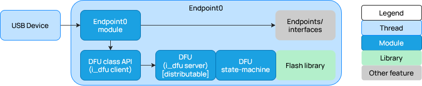
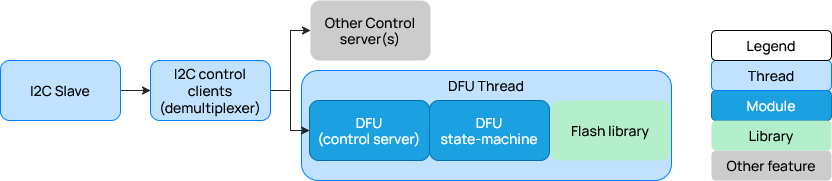
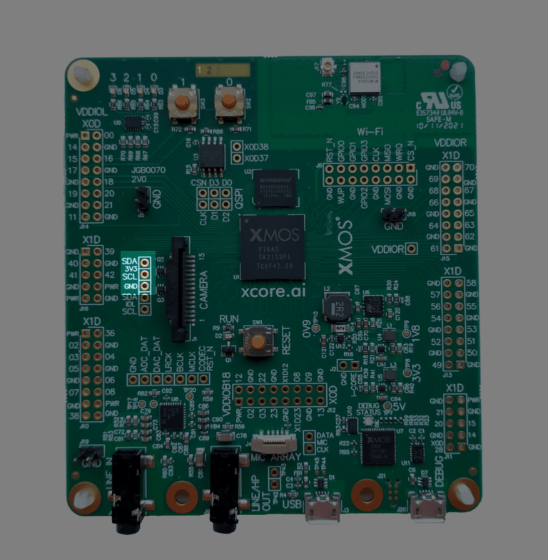
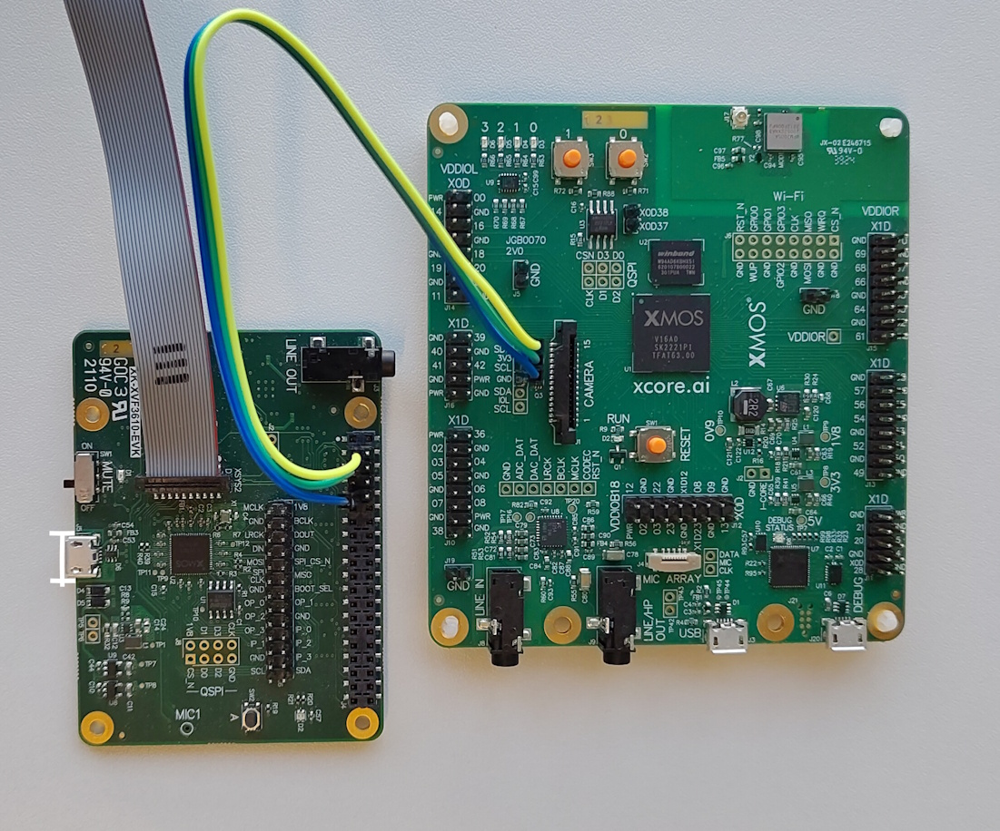
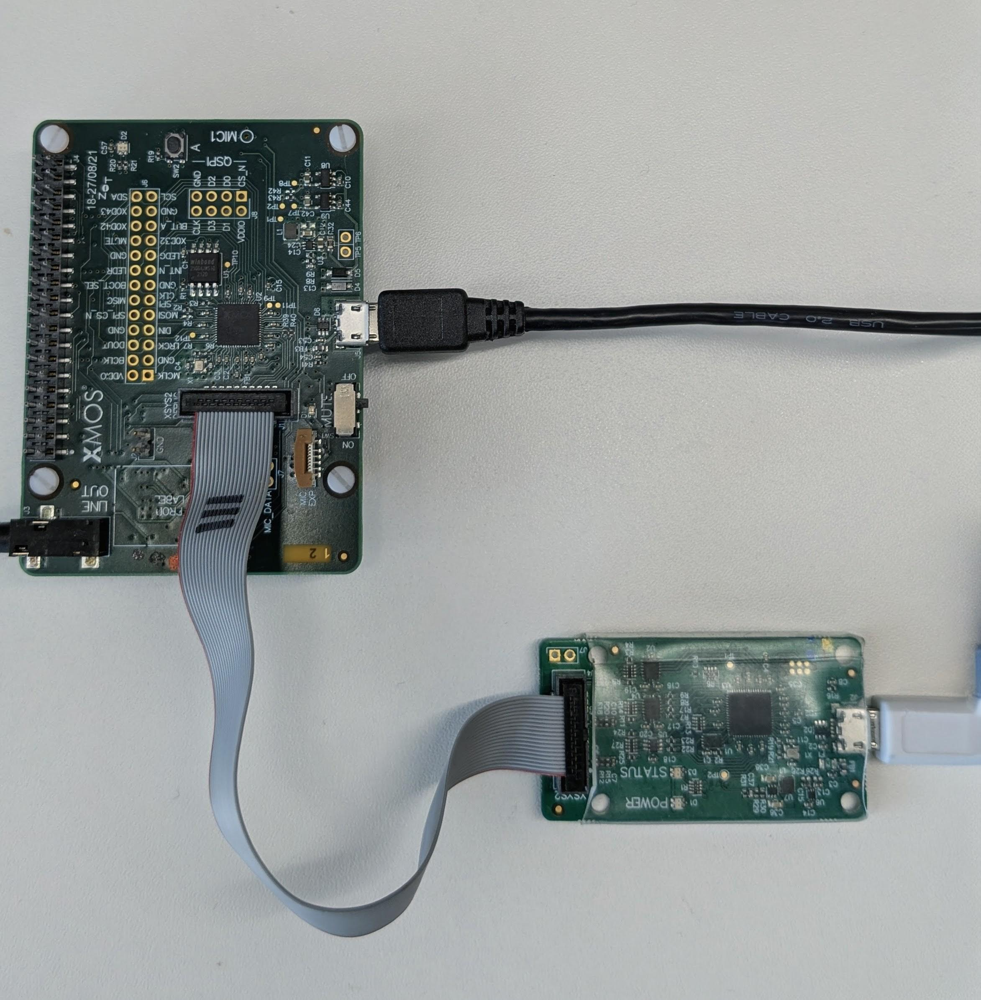

########################################
lib_dfu: Device Firmware Upgrade Library
########################################

|newpage|

************
Introduction
************

The Device Firmware Upgrade (DFU) library provides functionality to
facilitate firmware upgrades over various transport mechanisms. It includes
support for handling DFU packets, managing firmware images, and ensuring
the integrity of the upgrade process.

*****
Usage
*****

``lib_dfu`` is intended to be used with the
`XCommon CMake <https://www.xmos.com/file/xcommon-cmake-documentation/?version=latest>`_
, the `XMOS` application build and dependency management system.

To use this library in an application include ``lib_dfu`` in the application's ``APP_DEPENDENT_MODULES`` list in
`CMakeLists.txt`, for example:

.. code-block:: cmake

    set(APP_DEPENDENT_MODULES "lib_dfu")

.. note:: Dependent modules should be pinned to release versions where possible, otherwise the
   latest commit on the `develop` branch will be used.  For further details on managing modules,
   pinning to a release version and other options, please see the page
   `xcommon-cmake Dependency Management <https://www.xmos.com/documentation/XM-015090-PC/html/doc/dependency_management.html>`_.

For flash memory support in an application, this library requires linking to the Tool's Quad Flash library ``quadflash`` in
the application's ``APP_COMPILER_FLAGS`` list in `CMakeLists.txt`, for example:

.. code-block:: cmake

   set(APP_COMPILER_FLAGS  ... -lquadflash ...)

All ``lib_dfu`` functions can be accessed via the ``dfu.h`` header file, for example:

.. code-block:: C

    #include "dfu.h"

The library uses an optional header, ``dfu_conf.h``, when present in the application allows the user to reconfigure the library.
For example the following configuration allows the user to define the device's firmware version.
Please see the `DFU Configuration Options`_ section for details on all available configuration options.

.. code-block:: c

   #define DFU_BCD_DEVICE 0x0101

|newpage|

*********
Operation
*********

DFU Overview
============

In ``lib_dfu``, the DFU implementation is transport agnostic, and can be used with any physical transport by
implementing the necessary transport layer to receive DFU commands and send them to the DFU task.

This library is intended for a host device to update a target device, so the DFU implementation is designed to be used in the target device,
and a separate host application will need to be used to send the DFU commands from the host to the target device.

For DFU over USB, the DFU implementation in ``lib_dfu`` is compliant with version 1.1 of
`Universal Serial Bus Device Class Specification for Device Firmware Upgrade <https://www.usb.org/sites/default/files/DFU_1.1.pdf>`_.

This section describes the DFU implementation in ``lib_dfu``.
For information about using a DFU loader to send DFU commands to a USB device, refer to app-note
`AN02019: Using Device Firmware Upgrade (DFU) in USB Audio <www.xmos.com/file/an02019>`_.

For detailed information on creating a USB device with DFU capabilities, please see
`lib_xua: Device Firmware Upgrade (DFU) over USB <https://www.xmos.com/documentation/XM-012296-UG/html/doc/rst/sw_dfu.html>`_

For DFU over non-USB transports, the transport layer will need to be selected by the user, the example application
in this library demonstrates how to implement DFU over I2C using `lib_device_control <https://www.xmos.com/libraries/lib_device_control>`_.

This library uses the flash user library to manage the flash memory where the firmware images are stored, please see
`XMOS flash user library <https://www.xmos.com/documentation/XM-014363-PC/html/tools-guide/tools-ref/libraries/libquadflash-api/libquadflash-api.html>`_.

As seen in the flash library documentation the flash memory is divided into two sections, the factory image section and the upgrade image section.
Under normal circumstances the factory image will remain present for the life of the device and is used as a fallback in case the upgrade image is invalid.
The upgrade image is present after the new firmware is written during the DFU download process.

DFU Configuration 
=================

:numref:`opt_dfu` lists a few important DFU related configuration options.

For full details of all configuration options please see the `DFU Configuration Options`_ section.

.. list-table:: DFU defines
   :header-rows: 1
   :widths: 30 40 30
   :name: opt_dfu

   * - Define
     - Description
     - Default
   * - ``DFU_ENABLE``
     - Enable DFU functionality for device applications, disable for host applications.
     - ``1`` (Enabled)
   * - ``DFU_USB_EN``
     - Enable DFU over USB support. Disable for non-USB transports.
     - ``0`` (Disabled)
   * - ``DFU_CONTROL_SERVER``
     - Enable (non-USB) DFU over ``lib_device_control`` support. Disable for USB transports.
     - ``0`` (Disabled)
   * - ``DFU_BCD_DEVICE``
     - Device release number in binary-coded decimal (BCD) format.
     - ``0x0100`` (Version 1.0)

DFU Resources
=============

The DFU implementation in ``lib_dfu`` uses a number of threads to perform the DFU process.

For USB transports, there is the USB ``lib_xud`` thread, which handles the USB communication and passes it to
the ``endpoint0`` thread, which are outlined in :numref:`dfu_threads_usb`.
The ``endpoint0`` thread receives the DFU commands from the host and sends them to the DFU task. Due to the
use of the ``i_dfu`` interface, the DFU task can be ``distributable`` and thus called directly from the ``endpoint0`` thread,
so no additional threads are typically needed for the DFU task. However, if XUD is run on tile[1], DFU will require its own
thread on tile[0].

   DFU thread diagram for USB transports

For non-USB transports, there is a thread for the physical transport layer, a thread for the
`lib_device_control <https://www.xmos.com/libraries/lib_device_control>`_ ``control`` client, and one thread for the 
``control`` server with the DFU task, which are outlined in :numref:`dfu_threads_control`. Three threads in total.

   DFU thread diagram for non-USB transports

Design Constraints
------------------

The main constraint to be aware of when designing DFU functionality into an application is that
the DFU task must be running on ``tile[0]``, as the flash memory is only accessible from tile 0.
For details on working with flash memory on XCORE devices, please see
`Design and manufacture systems with flash memory <https://www.xmos.com/documentation/XM-014363-PC/html/tools-guide/tutorials/design-with-flash/flash.html>`_.

The physical transport can be on either tile as there is an interface to bridge the communications.

The secondary constraint is the time taken to perform the DFU process, particularly the flash erase and write operations,
which can take a a few minutes to complete with very large images (>512 kB).

The timing of the DFU process can be managed by setting the appropriate response values for the DFU status requests
managed through the configuration defines that start ``POLL_TIMEOUT_DNLOAD_``, see `DFU Configuration Options`_,
to allow the host to know how long to wait before sending the next command. Many of these values can be taken from the flash memory data-sheet.

DFU Lifecycle
=============

The lifecycle of a product with DFU is an important consideration when designing the DFU functionality, as it can impact the user experience and the security of the device.

The main stages of the product are:

1. **Manufacturing**: During this stage, the device is produced and the factory firmware image is flashed onto the device. The DFU functionality should be tested during this stage to ensure that it is working correctly.
2. **Deployment**: During this stage, the device is shipped to the end-users. The DFU functionality should be available to allow for firmware updates and bug fixes.
3. **Maintenance**: During this stage, the device is in use and may require firmware updates to add new features or fix bugs. The DFU functionality should be reliable and secure to ensure that firmware updates can be performed without issues.
4. **End of Life**: During this stage, the device is no longer supported and may not receive firmware updates. The DFU functionality may still be present, but it may not be secure or reliable. This can also include decommissioning of the device, where the DFU functionality can be used to erase the firmware and render the device inoperable.

Carefully considering the DFU lifecycle, and designing the DFU functionality accordingly, can help ensure that the device is secure and provides a good user experience throughout its lifecycle.

DFU and Device Security
=======================

Device security is an important consideration when implementing DFU functionality, as it involves
allowing firmware updates which, if not properly secured, could be exploited by malicious actors.

.. warning::
   No security is implemented in the DFU implementation in ``lib_dfu``.
   It is the responsibility of the user to implement necessary security measures in their application when using DFU functionality.

For information on securing XCORE devices, please see
`Safeguard IP and device authenticity <https://www.xmos.com/documentation/XM-014363-PC/html/tools-guide/tutorials/safeguard-ip/safeguard.html>`_.

Here are some security considerations to keep in mind when implementing DFU:

1. **Authentication**: Implement authentication mechanisms to ensure that only authorized users can perform firmware updates.
2. **Encryption**: Consider encrypting the firmware images to protect them from being tampered with or reverse engineered.
3. **Access Control**: Implement access control mechanisms to restrict who can initiate the DFU process.
4. **Secure Boot**: Implement a secure boot process that verifies the integrity of the firmware at startup.
5. **Rollback Protection**: Implement mechanisms to prevent rollback attacks, where an attacker tries to install an older, vulnerable version of the firmware.
6. **Logging and Monitoring**: Implement logging of DFU operations and monitor for any suspicious activity.

By carefully considering these security aspects and implementing appropriate measures, can help ensure that the DFU functionality in the user's device is secure and resistant to potential attacks.

DFU Operations
==============

Summary
-------

The DFU operations process is as follows:

1. The device starts in runtime mode, running the factory image or the upgrade image if it is valid.
2. The host sends a detach command to the device to switch it to DFU mode.
3. The device reboots into DFU mode and enumerates with the DFU descriptors.
4. The host sends DFU download or upload commands to write or read the firmware image to or from the device.
5. The host sends a detach command to the device to switch it back to runtime mode.

.. note::
   For non-USB transports, the device simply switches to DFU mode without rebooting, and the host can determine the mode switch by querying the device for its descriptors.

.. note::
   To return to runtime mode, the host typically sends a detach command to the device. A bus-reset is supported by the device but Windows hosts do not support sending a bus reset over USB when using the WINUSB driver.

XCORE Boot Process
------------------

The DFU depends on the XCORE boot process, and the role of the flash loader to run the upgrade image when valid, for more details please see
`Design and manufacture systems with flash memory <https://www.xmos.com/documentation/XM-014363-PC/html/tools-guide/tutorials/design-with-flash/flash.html>`_.

Description
-----------

Before starting the DFU upload or download process, the host sends a ``DFU_DETACH`` command to detach the device from runtime to DFU mode,
see :numref:`dfu_entry_seq_diag`.
In response to the ``DFU_DETACH`` command, the device reboots itself into DFU mode and enumerates using the DFU mode descriptors.
For non-USB transports such as I2C, the device simply transfers into DFU mode without rebooting, after a pause the host can determine
the mode switch by querying the device for its descriptors.
Once the device is in DFU mode, the DFU interface can accept commands defined by the
`DFU 1.1 class specification <https://www.usb.org/sites/default/files/DFU_1.1.pdf>`_.

.. uml:: ../images/dfu_entry.plantuml
   :caption: Message sequence chart for the DFU entry operation
   :align: center
   :width: 40%
   :name: dfu_entry_seq_diag

After detaching the device, the host proceeds with the DFU download/upload commands to write/read the firmware upgrade image to/from the device.

During the DFU download process, on receiving the first ``DFU_DNLOAD`` command, the device starts to erase
``FLASH_MAX_UPGRADE_SIZE`` bytes of the upgrade section of the flash, see :numref:`dfu_erase_seq_diag`. This is done by repeatedly calling the flash erase function until the entire upgrade section is erased,
and can take several seconds. To avoid the ``DFU_DNLOAD`` request timing out, the flash erase is instead done in the ``DFU_GETSTATUS`` handling
code. So, the device ends up returning the status as ``dfuDNBUSY`` several times while the flash
erase is in progress.

.. uml:: ../images/dfu_erase.plantuml
   :caption: Message sequence chart for the DFU erase operation
   :align: center
   :width: 70%
   :name: dfu_erase_seq_diag

:numref:`dfu_download_seq_diag` describes the DFU download process following the erase operation, where the device receives
data blocks and writes pages to flash (flash page is typically 256 bytes).

.. uml:: ../images/dfu_download.plantuml
   :caption: Message sequence chart for the DFU download operation
   :align: center
   :width: 60%
   :name: dfu_download_seq_diag

Once the DFU download or upload process is complete, the host sends a bus-reset to the device to switch it back to runtime mode.

.. note::

   Once a valid upgrade image is loaded in flash, on subsequent reboots, the device will boot from the upgrade image.
   If the upgrade image is invalid, the factory image will be loaded.
   To revert back to the factory image, send the command ``XMOS_DFU_REVERTFACTORY`` to erase the upgrade image.

Determining the DFU mode
------------------------

For USB transport, the device will enumerate with different USB descriptors, depending on whether it is in runtime mode or DFU mode.

For non-USB transports there is an extended command to allow the host to query the device, ``XMOS_DFU_GET_DESCRIPTOR``.

Extensions for non-USB transports
---------------------------------

To emulate the behaviour of a USB host there are some additional commands defined in the ``dfu_cmd_request`` enum for non-USB transports, these are:

- **XMOS_DFU_BUS_RESET**: For emulating bus/device reset
- **XMOS_DFU_GET_DESCRIPTOR**: For emulating getting a descriptor

Most of the slow operations are handled during the hold-off time allowed for after the ``DFU_GETSTATUS`` request by the `poll_timeout` value response.
But there are a few other operations for non-USB transports to be aware of, these are described below.

Timings for ``XMOS_DFU_BUS_RESET``, when transitioning to DFU mode, the host should hold off for at least 100ms
to allow the device to prepare the flash memory for the DFU process.
When transitioning to APP mode, the host should hold-off the next request for at least 500ms after sending the bus reset
command to allow the device to reboot and be ready for the next request.

Timings for ``XMOS_DFU_REVERTFACTORY``, the host should hold-off the next request for at least 250ms after sending the command
to allow the device to erase the upgrade image and be ready for the next request.

|newpage|

*****************
Host applications
*****************

Building the host applications
==============================

This section assumes that the host compiler is installed and in the path, for details per host OS please see `Host dependencies`_.

.. tab:: Linux and Mac hosts

   For Linux and Mac hosts, the host app can be built from a command terminal with the commands as shown:

   .. code-block:: console

      cd lib_dfu/host
      cmake -G "Unix Makefiles" -B build
      xmake -j -C build

.. tab:: Windows hosts

   For Windows hosts the process is the same except the Ninja generator is recommended to be used with CMake and the executable will have a ``.exe`` extension.
   The commands as shown:

   .. code-block:: console

      cd lib_dfu\host
      cmake -G "Ninja" -B build
      cmake --build build

The built host application executable will be found in the ``bin`` subdirectory under each of the host directories.

Host dependencies
-----------------

For Windows hosts, the supported compiler is `MSVC`.
The `Ninja build system <https://ninja-build.org/>`_ is recommended to be used with CMake, but it is not required.
The ``libusb`` library is provided in the library for applications such as ``xmosdfu``.

For Linux hosts, including Raspberry Pi, the supported compiler is `GCC`.
The ``libusb-1.0-0-dev`` package must be installed for USB transport.

For OSX hosts, the supported compiler is `Clang`. The ``libusb`` library is provided in the library for applications such as ``xmosdfu``.

Host ``dfu_i2c`` application
============================

This application provides a fully featured DFU host implementation over I2C using ``lib_device_control`` to send control commands.

.. note:: The application is only supported on a Linux host with I2C, such as a Raspberry Pi.

The application supports DFU with the following command-line arguments:

- ``--help``: Show help message and exit
- ``detach_and_bus_reset``: Send the detach command followed by a bus reset to switch the device from runtime to DFU mode
- ``reboot``: Send a bus reset to switch the device from DFU to runtime mode
- ``write_upgrade <boot.dfu>``: Write the specified firmware image to the device using DFU download commands, the file must include the DFU suffix.
- ``upload <file.bin>``: Read the firmware image from the device using DFU upload commands and save it to the specified file, the file will be binary and not include the DFU suffix.
- ``revert_factory``: Revert back to the factory image by erasing the first flash sector of the upgrade image.

The I2C address can be configured using ``--i2c-address <address>`` argument, which defaults to 0x2C.

Host ``suffix_generator`` application
=====================================

This is host app to generate the suffix of the firmware image in flash, this is used in the DFU download process
to write the suffix to flash after writing the firmware image.

.. note:: The USB DFU specification requires a valid suffix to be present in the firmware image.

Before generating a suffixed binary file, the xe file will need to be processed using ``xflash``.

.. code-block:: console

   After building the example...
   cd examples/i2c/device
   xflash --factory-version 15.3 --upgrade 1 bin/update/i2c_update.xe -o bin/update/i2c_update.bin

After extracting the binary file, a suffixed binary file can be generated using the ``suffix_generator``
application with the following command-line arguments:

.. code-block:: console

   cd lib_dfu/host/suffix_generator
   ./bin/dfu_suffix_generator <VID> <PID> <bcdDevice> <input_binary> <output_file>

So for example the following would generate a suffixed binary file with the VID, PID and bcdDevice values for the example application:

.. code-block:: console

   ./bin/dfu_suffix_generator 0x20b1 0x1234 0x0101 i2c_update.bin i2c_update_suffixed.bin

It is recommended to update the ``bcdDevice`` value for each new firmware version to allow the host to easily identify different versions of the firmware.

Host ``libsuffix_verifier`` library
===================================

This is host library can be used to verify the suffix of the firmware image in flash is correct,
`Host dfu_i2c application`_ uses this to verify firmware images before upgrading the device.

Host ``xmosdfu`` application
============================

``xmosdfu`` is a USB DFU host application that can be used to perform DFU operations such as firmware upgrades on XMOS devices over USB.
It uses the ``libusb`` library to communicate with the device over USB and provides a command-line interface.

For detailed instructions on using ``xmosdfu``, please see `AN02019: Using Device Firmware Upgrade (DFU) in USB Audio <www.xmos.com/file/an02019>`_.

|newpage|

*******************
Example application
*******************

Building the example
====================

This section assumes that the `XMOS XTC Tools <https://www.xmos.com/software-tools/>`_ have been
downloaded and installed. The required version is specified in the accompanying ``README``.

Installation instructions can be found `here <https://xmos.com/xtc-install-guide>`_.

Special attention should be paid to the section on
`Installation of Required Third-Party Tools <https://www.xmos.com/documentation/XM-014363-PC/html/installation/install-configure/install-tools/install_prerequisites.html>`_.

The application is built using the `xcommon-cmake <https://www.xmos.com/file/xcommon-cmake-documentation/?version=latest>`_
build system, which is provided with the XTC tools and is based on `CMake <https://cmake.org/>`_.

The ``lib_dfu`` software ZIP package should be downloaded and extracted to a chosen working
directory.

To configure the build, the following commands should be run from an XTC command prompt:

.. code-block:: bash

    cd lib_dfu/examples/i2c/device
    cmake -G "Unix Makefiles" -B build

If any dependencies are missing they will be retrieved automatically during this step.

The application binaries should then be built using ``xmake``:

.. code-block:: bash

    xmake -j -C build

Binary artifacts (.xe files) will be generated under the appropriate subdirectories of the
``examples/i2c/device/bin`` directory — one for each supported build configuration.

For subsequent builds, the ``cmake`` step may be omitted.
If ``CMakeLists.txt`` or other build files are modified, ``cmake`` will be re-run automatically
by ``xmake`` as needed.

Building the example host app
=============================

This is very similar to building the device example, please follow the build instructions in the
`Building the example`_ section to build the host application, except the host example is in the
``examples/i2c/host_xcore`` directory.

Example Hardware Setup
======================

The example is `XCORE` to `XCORE` over I2C, so two `XCORE` boards are needed. The example was developed and tested using the ``XK-EVK-XU316`` and the ``XK-VOICE-L71``.

Connect three jumper wires between the ``XK-EVK-XU316`` and the ``XK-VOICE-L71`` to allow the I2C communication between the host and device.

For the ``XK-EVK-XU316``, connect the jumper wires as shown in the :numref:`board_xk_evk_xu316` and :numref:`example_hw_setup_2_xk`, connecting the I2C `SCL`, `SDA` and `GND` pins to the corresponding pins on the ``XK-VOICE-L71``.

   XK-EVK-XU316 I2C Hardware setup

The ``XK-VOICE-L71`` uses the Raspberry Pi GPIO pins for I2C communication. For more information, refer to the
`Raspberry Pi GPIO Documentation <https://www.raspberrypi.com/documentation/computers/raspberry-pi.html#gpio>`_.

   Connecting I2C between the XK-EVK-XU316 and XK-VOICE-L71

To run the example, connect a USB cable to power the ``XK-VOICE-L71`` board as shown in :numref:`board_l71_hw_setup`,
and plug the XTAG to the board and connect the XTAG USB cable to the development machine. And also connect two
USB cables to the ``XK-EVK-XU316`` to power it and allow programming and xscope communication.

   XK-VOICE-L71 USB Hardware setup

Determining the XTAG adapter ID
===============================

When running two XTAGs connected to the development machine, one for the host and one for the device, the XTAG adapter ID will
need to be provided to `xrun` to specify which XTAG to use for the host and which one to use for the device.
The XTAG adapter ID's can be found using the `xrun` command from an XTC command prompt.
An example output is shown below:

.. code-block:: console

   $ xrun -l

   Available XMOS Devices
   ----------------------

   ID    Name                    Adapter ID      Devices
   --    ----                    ----------      -------
   0     XMOS XTAG-4             ABCDEFGH        XS3A[0]
   1     XMOS XTAG-4             IJKLMNOP        XS3A[0]

Running the example
===================

The device example needs to be running, otherwise the host will fail to connect to the device.

.. note::
   The example is not a fully featured DFU implementation, it is designed to show the DFU detach process from runtime to DFU mode,
   so the device example will start in runtime mode, and only switch to DFU mode after receiving the detach command from the host.

From an XTC command prompt, the following command should be run from the ``examples/i2c/device`` directory:

.. code-block:: console

    xrun --xscope --adapter-id <device_xtag_adapter_id> ./bin/i2c.xe

Alternatively, the application can be programmed into flash memory for standalone execution:

.. code-block:: console

   xflash --adapter-id <device_xtag_adapter_id> ./bin/i2c.xe

Running the host example
========================

From an XTC command prompt, the following command should be run from the ``examples/i2c/host_xcore`` directory:

.. code-block:: console

    xrun --xscope --adapter-id <host_xtag_adapter_id> ./bin/host_i2c_xcore.xe

Output when running the example
-------------------------------

The output from the host shows the DFU detach process, followed by a simple control data exchange
between the host and device to show that the communication is working as expected.

.. code-block:: console

   xrun --xscope --adapter-id <host_xtag_adapter_id> ./bin/host_i2c_xcore.xe
   i2c ready
   Starting Control DFU example
   DFU state: 0
   DFU status: 0, timeout: 0 ms, next state: 0
   Sent detach command
   DFU status: 0, timeout: 0 ms, next state: 1
   Sent bus reset command
   DFU status: 0, timeout: 0 ms, next state: 2
   control write command 9 failed with 5
   Sent bus reset command
   DFU status: 0, timeout: 0 ms, next state: 0
   Starting Control data example
   Written and read back command with payload: 0x00
   Written and read back command with payload: 0x01
   Written and read back command with payload: 0x02
   Written and read back command with payload: 0x03
   done

|newpage|

**********
References
**********

* `USB Firmware Upgrade (DFU) 1.1 <http://www.usb.org/sites/default/files/DFU_1.1.pdf>`_
* `XMOS flash user library <https://www.xmos.com/documentation/XM-014363-PC/html/tools-guide/tools-ref/libraries/libquadflash-api/libquadflash-api.html>`_
* `AN02019: Using Device Firmware Upgrade (DFU) in USB Audio <www.xmos.com/file/an02019>`_
* `Safeguard IP and device authenticity <https://www.xmos.com/documentation/XM-014363-PC/html/tools-guide/tutorials/safeguard-ip/safeguard.html>`_
* `Design and manufacture systems with flash memory <https://www.xmos.com/documentation/XM-014363-PC/html/tools-guide/tutorials/design-with-flash/flash.html>`_

|newpage|

**************
Functional API
**************

See `Usage`_ section and `Example application`_ for details on usage of the following.

Data Structures/Types
=====================

.. doxygenenum:: dfu_state

.. doxygenenum:: dfu_status

.. doxygenenum:: dfu_cmd_request

.. doxygenenum:: dfu_api_status

.. doxygenstruct:: dfu_cmd_response
   :members:

API Functions
=============

<dfh.h>
-------

.. doxygengroup:: lib_dfu_api

<dfu_usb_server.h>
------------------

.. doxygenfunction:: dfu_usb_server

<dfu_usb_requests.h>
--------------------

.. doxygengroup:: lib_dfu_api_usb

<dfu_control_server.h>
----------------------

.. doxygengroup:: lib_dfu_api_control

DFU Configuration Options
=========================

.. doxygengroup:: lib_dfu_config

